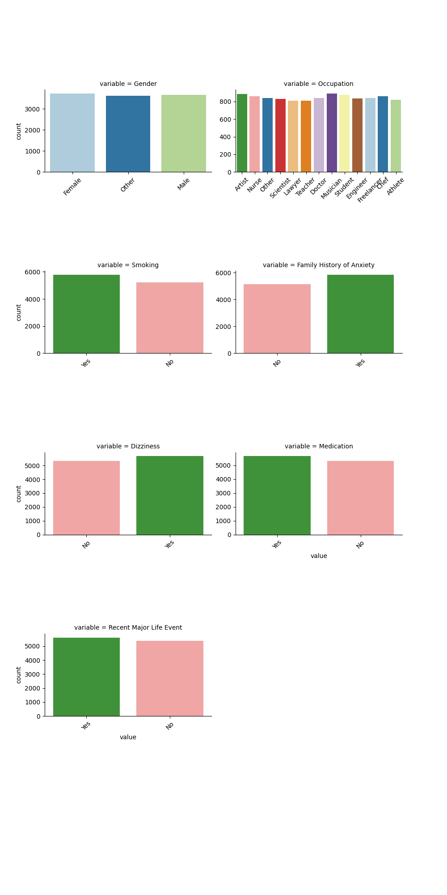
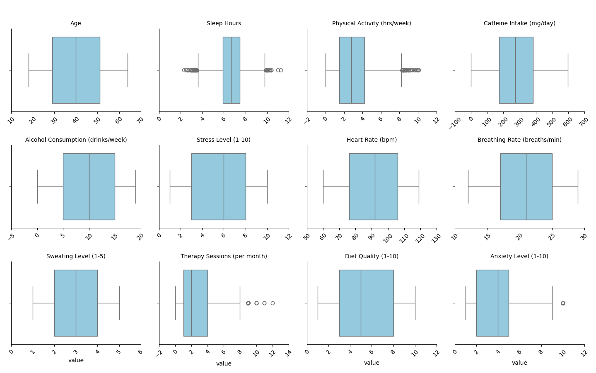
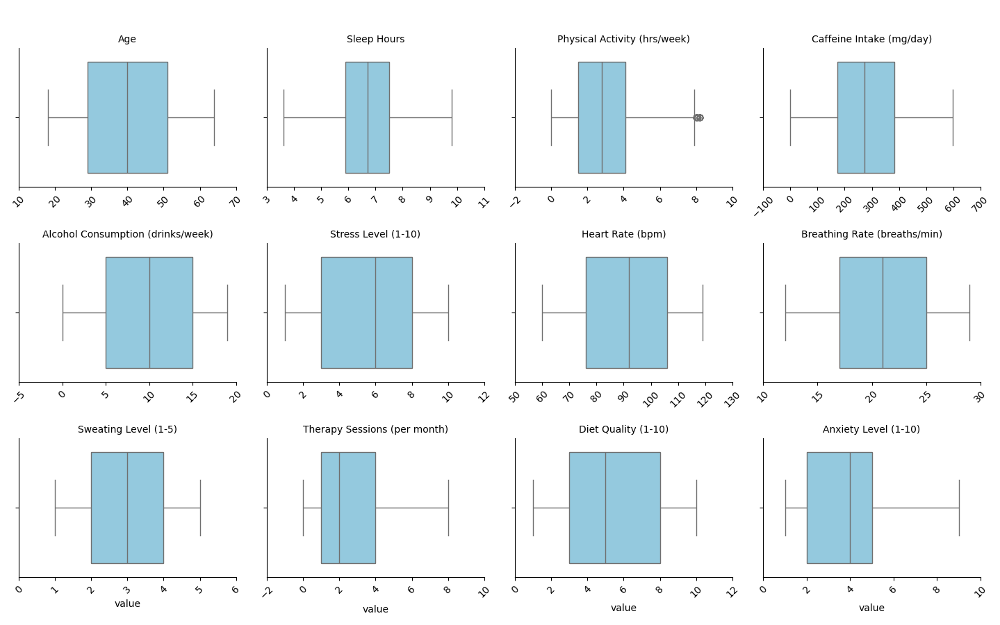
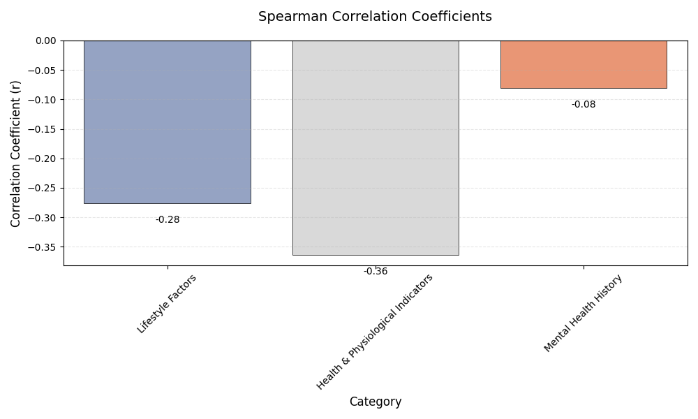
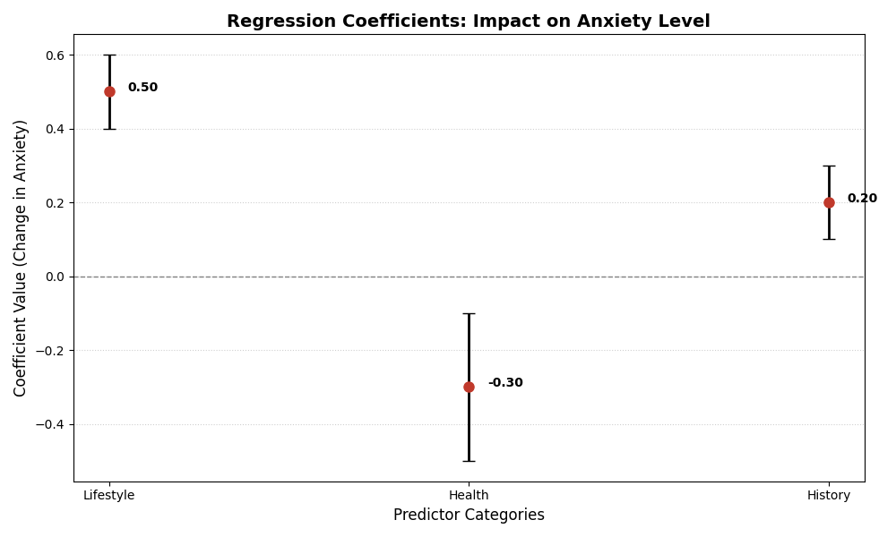
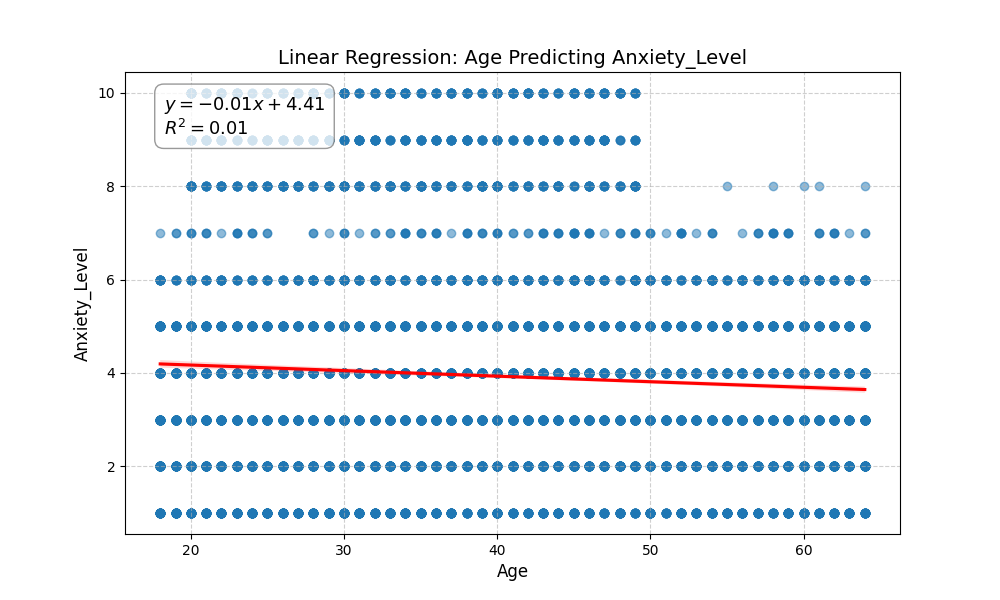
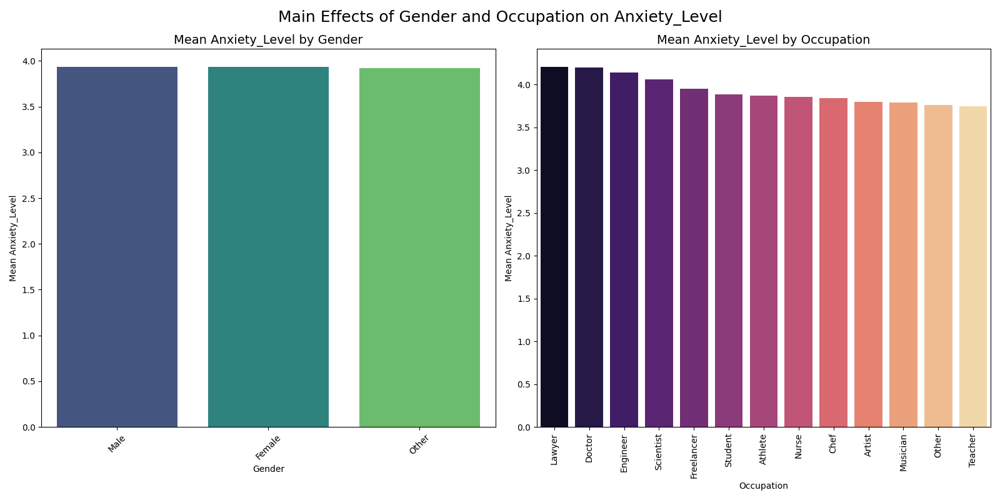
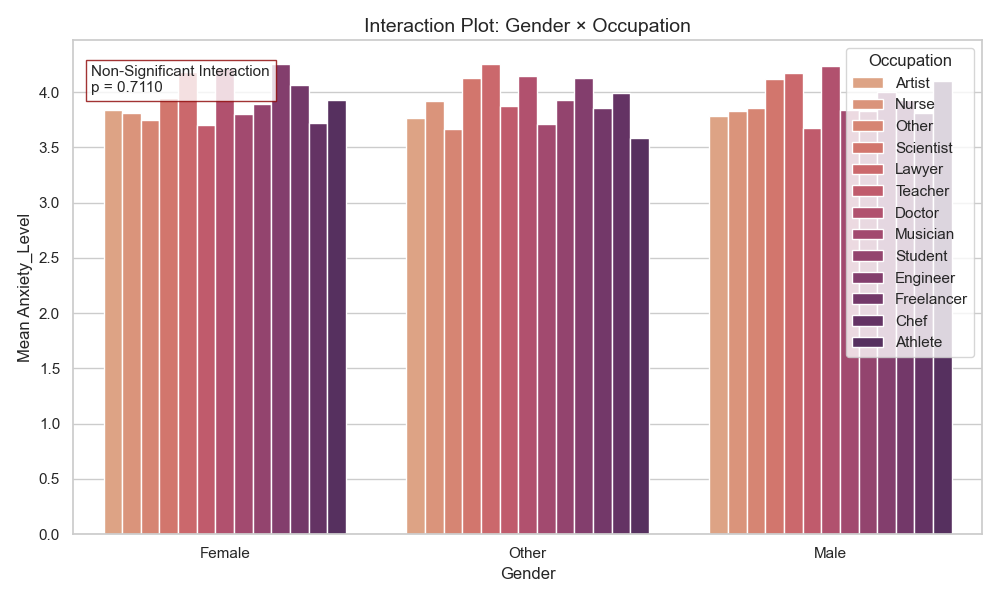

# Social Anxiety Data Analysis

[](https://www.python.org/)
[](https://www.kaggle.com/datasets/natezhang123/social-anxiety-dataset)

**Pipeline Overview:**  
Data Import → Integrity & Outlier Assessment → Categorization & Binarization → Statistical Modeling → Visualization (Auto‑Saved) → Logging

## Project Description
This project investigates the factors influencing social anxiety levels using a synthetic dataset of 11,000 observations. The analysis explores how individual lifestyle choices, physiological indicators, and demographic variables -specifically age, gender, and occupation- are associated with anxiety severity.


### Main Objectives
1.  **Identify Key Drivers:** Determine which categories (Lifestyle, Physiological Health, or Mental Health History) show the strongest statistical association with anxiety.
2.  **Evaluate Age Impact:** Analyze whether age has a meaningful linear association with anxiety levels.
3.  **Interaction Analysis:** Assess the individual and interactive effects of **Gender** and **Occupation** on social anxiety levels.
4.  **Statistical Modeling:** Build models to quantify the impact of each factor category.

### Assumptions & Hypotheses
* **Lifestyle, Physiological Health and Mental Health History:** it is hypothesized that physiological indices, such as heart rate and respiration rate, will exhibit the most robust statistical association with social anxiety severity, surpassing the predictive value of lifestyle factors or clinical and therapeutic history.
* **Age:** We hypothesize a significant inverse linear relationship between respondent age and social anxiety levels; specifically, we predict that as chronological age increases, reported levels of social anxiety will significantly decline.
* **Gender & Occupation:** A significant interaction is hypothesized between gender and occupation, such that the impact of occupation type on social anxiety levels will be moderated by the individual's gender.

---

##  Project Structure
```text
project/
│
├── Data/
│   ├── SocialAnxiety_dataset.csv      # Primary dataset (11,000 rows)
│   └── health_guidelines.xlsx         # WHO/NIH reference thresholds
│
├── Initial_Data_Analysis/
│   └── initial_analysis.py            # Data integrity checks & IQR outlier detection
│
├── Category_relations/
│   ├── binarize_category.py           # Binarization based on health standards
│   ├── Categorization.py              # Variable grouping into conceptual categories
│   ├── multiple_linear_regression.py  # Regression model for category contributions
│   ├── spearman_test.py               # Spearman correlation analysis
│   └── stat_visualization.py          # Statistical plots (correlations, coefficients)
│
├── Age_Regression/
│   └── regression.py                  # Pearson correlation & linear regression (Age → Anxiety)
│
├── Occupation_Gender_Two_Way_ANOVA/
│   ├── main_effects.py                # Main effects of Gender & Occupation
│   ├── interactions.py                # Interaction effect analysis
│   └── __init__.py
│
├── Visualization/
│   ├── *.png                          # All generated plots
│   └── visualization_saving_decorator.py  # Auto-save decorator for figures
│
├── Tests/
│   ├── test_binarization.py
│   ├── test_categorization.py
│   ├── test_initial_data_analysis.py
│   ├── test_interactions.py
│   ├── test_main_effect.py
│   ├── test_multi_regression.py
│   ├── test_multireg_visualization.py
│   ├── test_regression.py
│   ├── test_spearman.py
│   └── test_spearman_visualization.py
│
├── main.py                            # Full pipeline execution
├── requirements.txt                   # Dependencies
├── README.md
└── SocialAnxiety_Project.log          # Execution log


```

---

## Methodology & Key Stages

### 1. Data Importing, Processing & Cleaning
* **Integrity Check:** The dataset (11,000 rows, 19 variables) was verified for completeness, with **no missing** values and no structural inconsistencies.

### Frequency Plots



* **Outlier Detection:** Using the **IQR (Interquartile Range)** method, 666 potential outliers were identified. After evaluation, these values were retained due to their **minimal impact** on the distribution and statistical results.
* **Data Cleaning Decision:** Since the dataset showed full completeness and the detected outliers did not meaningfully affect the analysis, **no data cleaning or removal procedures were required.**

### Raw Data: Outliers Detected but Not Removed


### Clean Data After Removing Outliers



### 2. Statistical Research Questions

### **Q1: Which life category shows the strongest association to social anxiety?**
* **Method:**
* ***Binarization:*** Variables were converted into binary format (0/1) based on **NIH** and **WHO** guidelines. Values within "healthy" ranges were assigned a value of 1.
* ***Classification:*** Variables grouped into three categories: Lifestyle, Mental Health History, Physiological Health.
* ***Statistics:*** Spearman correlations and Multiple Linear Regression were applied.
* **Result:** The model explained **29.6%** of the variance (**R² = 0.296**). **Lifestyle habits** and **Physiological health** were the strongest predictors.

### Spearman Correlation Coefficients


### Regression Coefficients: Impact on Anxiety Level


### **Q2: Does age significantly impact social anxiety?**
* **Method:** Pearson correlation and linear regression.
* **Result:** The correlation was statistically significant but **extremely weak (r ≈ -0.01)**, suggesting age is not a meaningful linear predictor here.

### Linear Regression: Age Predicting Anxiety Level


### **Q3: To what extent do gender and occupation, both as independent factors and through their interaction, influence levels of social anxiety?**
* **Method:** **Two-Way ANOVA** to calculate main and interaction effects.
* **Result:** Analysis revealed no significant main effect of gender and no significant gender–occupation interaction on social anxiety levels (p = .711). **However, a significant main effect of occupation was observed**, indicating meaningful differences in anxiety levels across occupational groups independent of gender

### Main Effects of Gender and Occupation


### Interaction Effect: Gender × Occupation



### 3. Results Visualization
The visual outputs for each research question were generated through **dedicated plotting functions**, all of which are wrapped with an automatic saving **decorator** and saved automatically in the [Visualization](Visualization/) directory.

This mechanism ensures that every figure produced during the analysis is consistently saved to the visualization directory without requiring manual export, thereby maintaining a complete and reproducible record of all graphical results.

---

## Dataset Description
* **Source:** [Kaggle - Social Anxiety Dataset](https://www.kaggle.com/datasets/natezhang123/social-anxiety-dataset)
* **Variables:** Demographics, sleep quality, physical activity, caffeine intake, heart rate, and mental health history.
* **Target:** Anxiety Level (Scale 1–10).

---

## Installation & Running

### **1. Clone the repository**
```bash
git clone [https://github.com/moriah20/SocialAnxiety_data_analysis.git](https://github.com/moriah20/SocialAnxiety_data_analysis.git)
cd SocialAnxiety_data_analysis
```
## **2. Install dependencies**
```Bash

pip install -r requirements.txt
```
## **3. Run the complete pipeline**
```Bash

python main.py
```
## Outputs: log file 

## Visuals: All plots are generated and saved in the 'visualization' folder during execution. 
Using the auto_save_plot decorator.

## **References**
* ***NIH:*** Standards for physiological health indicators.
https://www.ncbi.nlm.nih.gov/books/NBK596717/table/ch1survey.T.normal_respiratory_rate_by_a/
https://www.ncbi.nlm.nih.gov/books/NBK593193/table/ch1survey.T.normal_heart_rate_by_age/
https://www.ncbi.nlm.nih.gov/books/NBK591812/table/ch12sleepandrest.T.recommended_amounts_o/
https://pmc.ncbi.nlm.nih.gov/articles/PMC6296805/

* ***WHO:*** Guidelines for physical activity lifestyle
https://www.emro.who.int/health-education/physical-activity/recommended-levels-of-physical-activity-for-health.html

* ***CDC:*** Guidelines for Alcohol Use
https://www.cdc.gov/alcohol/about-alcohol-use/moderate-alcohol-use.html

* ***charlie health:*** Recomended Frequently for Therapy Sessions
https://www.charliehealth.com/treatment-modalities/cognitive-behavioral-therapy/how-often-should-you-go-to-therapy

* ***Kaggle:*** Dataset 
https://www.kaggle.com/datasets/fedesoriano/stroke-prediction-dataset?select=healthcare-dataset-stroke-data.csv


Developed by **Moriah, Orin & Aviya**


